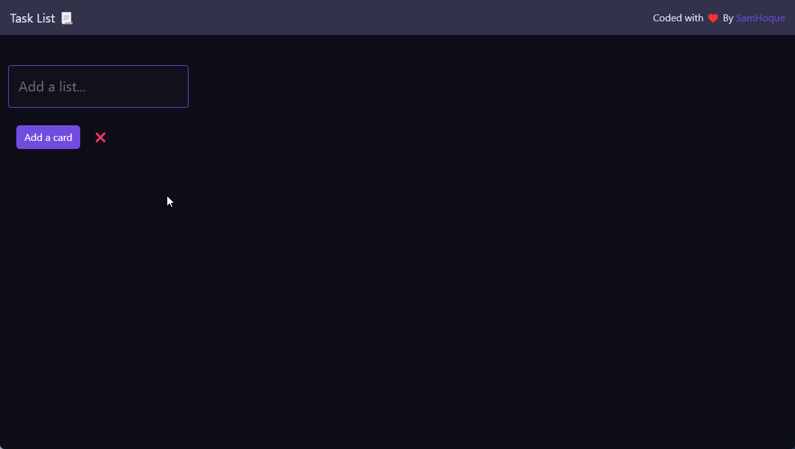

# Task List Application

A Task list application frontend created in React & TypeScript.


## Demo



## Run Locally

Clone the project

```bash
  git clone https://github.com/SamHoque/typescript-tasklist
```

Go to the project directory

```bash
  cd typescript-tasklist
```

Install dependencies

```bash
  npm install
```

You may need to install graphql

```bash
  npm install -g graphql
```

Start the server

```bash
  npm run start
```


## Related

You can find the backend code here


[Task List Backend](ypescript-tasklist-backend)


## Authors

- [@SamHoque](https://www.github.com/SamHoque)

